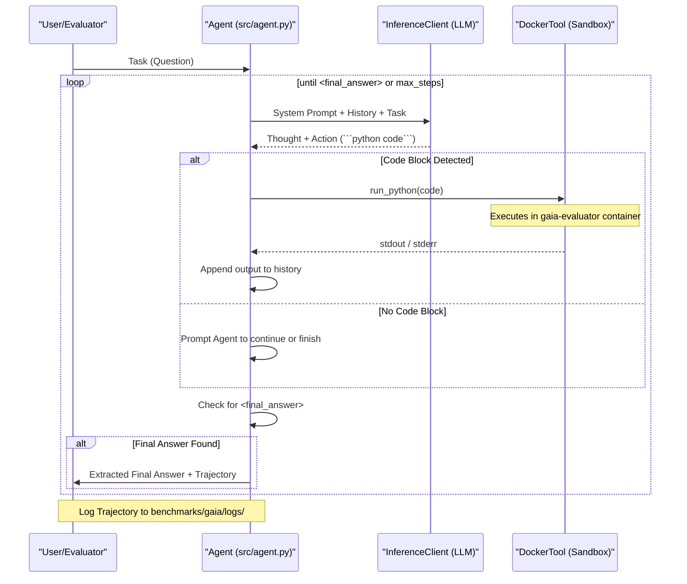

# agentBench

A framework for reproducing benchmark scores for local LLMs on agentic tasks. Currently focused on the **GAIA** (General AI Assistants) benchmark.

## Agentic Loop Design

The following diagram illustrates the **ReAct (Reasoning and Acting)** loop implemented in this project:



## Project Structure

- `src/`: Core implementation.
  - `inference.py`: Connection to local LLM backends (LM Studio).
  - `agent.py`: ReAct loop and tool definitions.
- `benchmarks/gaia/`: GAIA-specific setup.
  - `data/`: Downloaded benchmark datasets.
  - `evaluator/`: Docker configuration for sandboxed execution.
  - `evaluate.py`: Evaluation script with trajectory logging.
  - `logs/`: Trajectory logs for each task.

## Usage

1. **Setup Environment:**
   ```bash
   uv sync
   ```
2. **Download Benchmark Data:**
   ```bash
   uv run python benchmarks/gaia/download_gaia.py
   ```
3. **Run Evaluation:**
   ```bash
   uv run python -m benchmarks.gaia.evaluate
   ```
