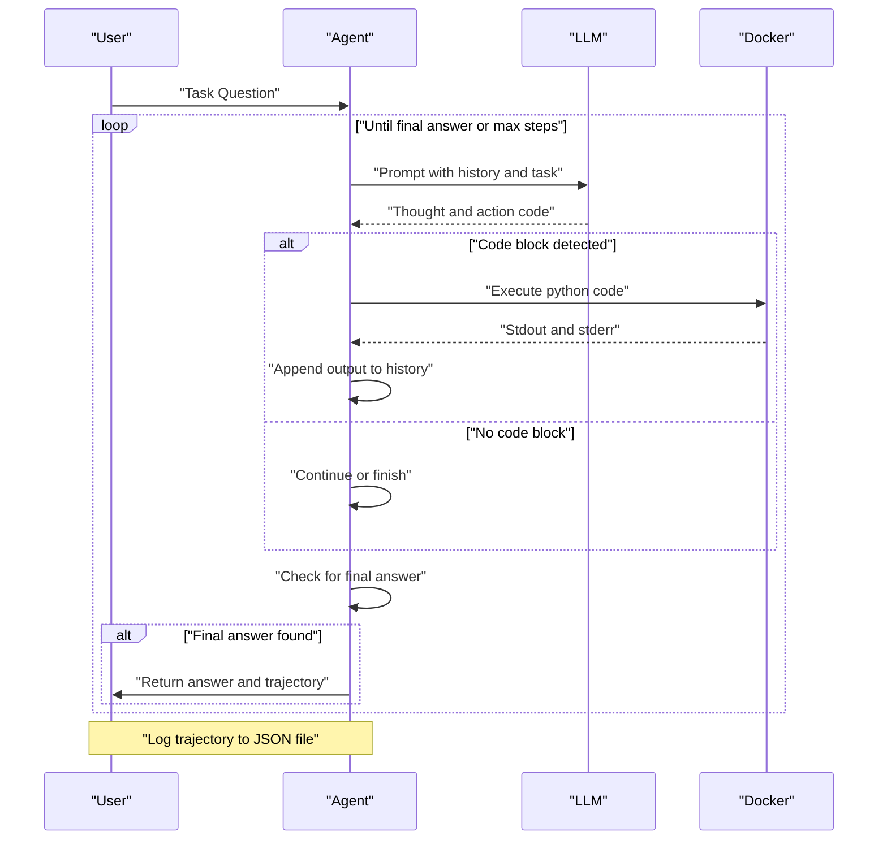

# agentBench

A framework for reproducing benchmark scores for local LLMs on agentic tasks. Currently supports the **GAIA** (General AI Assistants) and **Tau2-Bench** benchmarks.

## Agentic Loop Design

The following diagram illustrates the **ReAct (Reasoning and Acting)** loop implemented in this project:



## Project Structure

- `src/`: Core implementation.
  - `inference.py`: Connection to local LLM backends (LM Studio).
  - `agent.py`: ReAct loop and tool definitions.
- `benchmarks/gaia/`: GAIA-specific setup.
  - `data/`: Downloaded benchmark datasets.
  - `evaluator/`: Docker configuration for sandboxed execution.
  - `evaluate.py`: Evaluation script with trajectory logging.
  - `logs/`: Trajectory logs for each task.
- `benchmarks/tau2_bench/`: Tau2-Bench setup.
  - `repo/`: Cloned official Tau2-Bench repository.
  - `evaluate.py`: Evaluation wrapper script for local LLMs.
- `debug_responses/`: Raw JSON responses from the LLM (for debugging).

## Usage

### 1. Setup Environment
```bash
uv sync
```
Ensure your `.env` file is configured with your local LM Studio endpoint and token.

### 2. Run GAIA Evaluation
GAIA tasks are executed using a custom ReAct agent with Docker-based Python code execution.
```bash
# Download data (first time only)
uv run python benchmarks/gaia/download_gaia.py

# Run evaluation (default first 3 text tasks)
uv run python -m benchmarks.gaia.evaluate
```
Logs are saved to `benchmarks/gaia/logs/`.

### 3. Run Tau2-Bench Evaluation
Tau2-Bench tasks involve complex, dual-control interactions in specialized domains.
```bash
# Wrapper script from repo root (good default path)
uv run python -m benchmarks.tau2_bench.evaluate --num-tasks 3 --domain airline

# Complete direct Tau2 CLI run (set agent/user models independently)
cd benchmarks/tau2_bench/repo && uv run tau2 run \
  --domain airline \
  --agent llm_agent \
  --user user_simulator \
  --agent-llm openai/google/gemma-4-26b-a4b \
  --user-llm openai/google/gemma-4-26b-a4b \
  --num-trials 1 \
  --num-tasks 3 \
  --max-steps 200 \
  --verbose-logs
```

**Available Domains:**
- `airline`: Flight booking, cancellation, and customer support.
- `retail`: Order management, returns, and product inquiries.
- `telecom`: Telecom account management and troubleshooting.
- `banking_knowledge`: Customer service with configurable RAG pipelines.
- `mock`: Lightweight test domain for development.

- **Results:** Saved to `benchmarks/tau2_bench/repo/data/simulations/`.
- **Debug Logs:** Raw model responses are captured in `debug_responses/`.

### 4. Reviewing Results
To interactively view Tau2-Bench trajectories via CLI:
```bash
cd benchmarks/tau2_bench/repo && uv run tau2 view
```

To generate a standalone **HTML Report** for a specific run:
```bash
uv run python benchmarks/tau2_bench/visualize_results.py <path_to_results.json>
```

To view GAIA trajectories, inspect the JSON files in `benchmarks/gaia/logs/`.

## Tau2 FAQ

### Where can I set agent model and user model differently?
Use `tau2 run` flags:
- `--agent-llm <model>`
- `--user-llm <model>`

### What are the default agent/user models?
Both default to:
- `gpt-4.1-2025-04-14`

### Where are tool descriptions defined?
Tool descriptions come from tool function docstrings in domain toolkit files, e.g.:
- `benchmarks/tau2_bench/repo/src/tau2/domains/airline/tools.py`

These are parsed into tool schemas by:
- `benchmarks/tau2_bench/repo/src/tau2/environment/tool.py`

### How does the agent know it cannot cancel a flight?
Cancellation rules are in the airline policy:
- `benchmarks/tau2_bench/repo/data/tau2/domains/airline/policy.md`

The environment loads this policy and the LLM agent follows it at runtime. The cancellation API itself does not enforce all policy rules.

### Why is `action_checks` empty, and how do I enable it?
`action_checks` are only meaningful when task definitions include expected actions.

Add non-empty `evaluation_criteria.actions` in task JSON and include `ACTION` in `evaluation_criteria.reward_basis` if you want action checks to affect reward.

### Which model generated user responses in a results file?
Check:
- `info.user_info.llm` (configured user simulator model)
- `simulations[*].messages[*].raw_data.model` (provider-returned model name)
