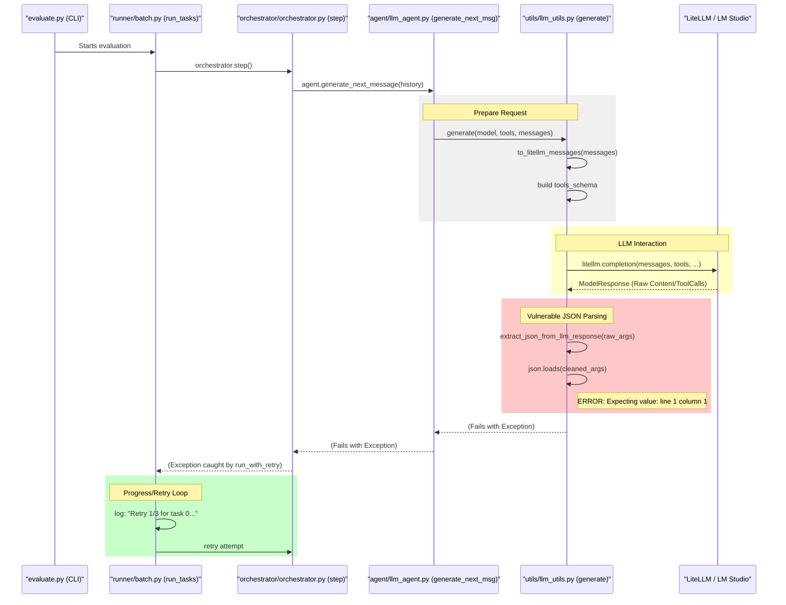

# Tau2-Bench LLM Interaction Debug Loop

This diagram traces the flow of an LLM request through the `tau2` framework, highlighting the critical points where JSON parsing and LiteLLM interactions occur.

### Critical Debug Points:
1.  **Request Format (`utils/llm_utils.py`):** Are the `litellm_messages` or `tools_schema` formatted in a way that confuses LM Studio?
2.  **Model Output (`L -> U`):** Does the model return a text thought *before* the tool call, or does it wrap the entire response in a non-JSON format?
3.  **JSON Parsing (`utils/llm_utils.py`):** The `json.loads` on `tool_call.function.arguments` is where the current error is thrown. This means `LiteLLM` successfully identified a tool call but the string inside `arguments` isn't a valid JSON object.
